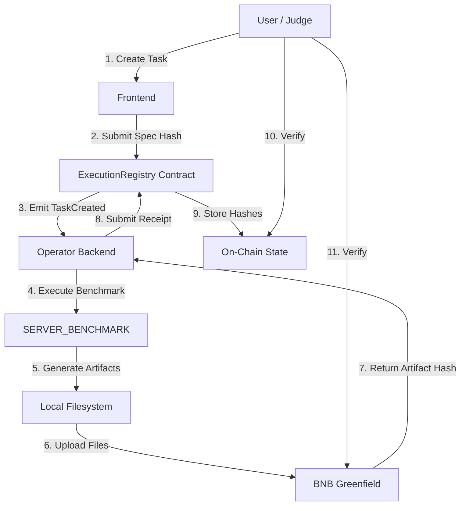
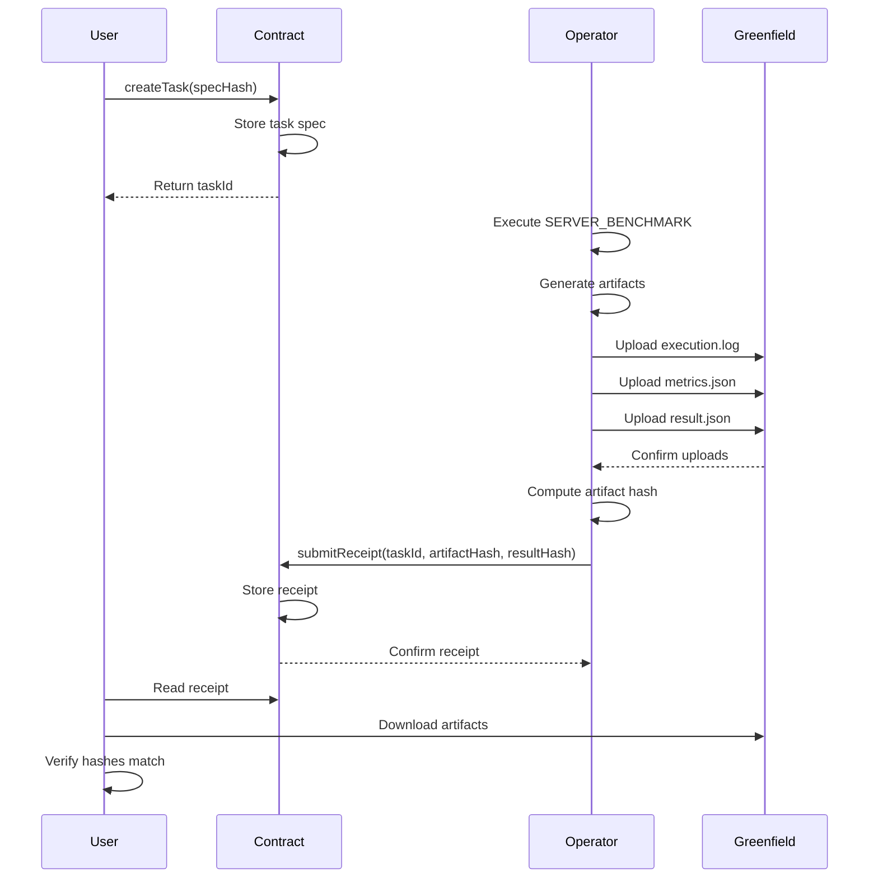

# InfraProof

**InfraProof is a verification layer that allows decentralized infrastructure operators to prove that off-chain execution actually happened, without requiring trust.**

## Table of Contents

- [Project Overview](#project-overview)
- [Problem Statement](#problem-statement)
- [High-Level Architecture](#high-level-architecture)
- [User Journey](#user-journey)
- [What the Execution Logs Mean](#what-the-execution-logs-mean)
- [Smart Contract Deployment](#smart-contract-deployment)
- [Greenfield Storage](#greenfield-storage)
- [Local & Testnet Deployment](#local--testnet-deployment)
  - [Running Locally (Anvil)](#running-locally-anvil)
  - [Deploying to BSC Testnet](#deploying-to-bsc-testnet)
- [Design Principles](#design-principles)
- [Future Work & Roadmap](#future-work--roadmap)
- [How Judges Should Evaluate This Project](#how-judges-should-evaluate-this-project)

## Project Overview

InfraProof addresses a fundamental challenge in decentralized physical infrastructure networks (DePIN): verifying that off-chain work was actually performed. When infrastructure operators claim to have executed compute tasks, sensor readings, or storage operations, there is currently no trustless way to verify these claims.

This protocol combines on-chain commitments with decentralized storage to create an auditable execution trail. Task specifications are committed to the blockchain before execution, artifacts are stored on BNB Greenfield after execution, and cryptographic hashes link the two together. The result is a verification layer that doesn't require trusting the operator.

This demo implements a `SERVER_BENCHMARK` execution type, proving that CPU, memory, and disk I/O operations were actually performed. The benchmark runs deterministic tests that produce verifiable artifacts, demonstrating how any type of off-chain work can be made provable.

InfraProof is built for the BNB Hack DePIN track, leveraging BSC for state commitments and Greenfield for artifact storage.

## Problem Statement

Off-chain execution in DePIN networks faces a trust problem. Operators can claim they performed work, but verifying these claims is difficult:

**Logs alone are insufficient** because they can be fabricated. An operator can generate fake execution logs without actually running the workload. There's no way to distinguish between real execution traces and manufactured ones.

**Blockchain alone is insufficient** because storing full execution artifacts on-chain is prohibitively expensive. A single benchmark run generates kilobytes of logs and metrics—multiplied across thousands of tasks, this becomes untenable.

**A hybrid approach is required** that combines the strengths of both systems. The blockchain provides tamper-proof timestamps and commitments. Decentralized storage provides cost-effective artifact preservation. Cryptographic hashes bridge the two, creating a verification trail that is both trustless and economically viable.

InfraProof implements this hybrid model, allowing anyone to verify execution by checking on-chain commitments against stored artifacts.

## High-Level Architecture



**Component Responsibilities:**

- **ExecutionRegistry Contract**: Stores task specifications and execution receipts. Emits events for indexing. Does not validate execution correctness.
- **Operator Backend**: Executes tasks, generates artifacts, uploads to Greenfield, submits receipts. Runs autonomously after task creation.
- **BNB Greenfield**: Stores execution artifacts (logs, metrics, results) in a decentralized, content-addressed manner. Files are public and sealed.
- **Frontend**: Provides task creation interface and status monitoring. Purely for demonstration—protocol works without it.

## User Journey



**Step-by-Step Flow:**

1. **User creates a SERVER_BENCHMARK task** via the frontend, specifying execution parameters (duration, memory size, disk size).
2. **Task specification is committed on-chain** as a keccak256 hash, creating an immutable record of what was requested.
3. **Operator executes real off-chain work**, running CPU prime calculations, memory read/write operations, and disk I/O tests.
4. **Execution artifacts are uploaded to Greenfield** as three separate files: human-readable logs, structured metrics, and canonical results.
5. **Artifact hash is committed back on-chain** via `submitReceipt()`, linking the execution proof to the original task.
6. **Anyone can independently verify execution** by downloading artifacts from Greenfield and recomputing hashes against on-chain commitments.

## What the Execution Logs Mean

| File | Purpose | Who Uses It |
|------|---------|-------------|
| `execution.log` | Human-readable execution trace with timestamps, progress updates, and completion status | Judges / reviewers inspecting execution flow |
| `metrics.json` | Structured performance metrics (ops/sec, MB/s) and system information in JSON format | Verifiers / programs parsing results programmatically |
| `result.json` | Canonical execution summary with full test results, used for hash computation | Protocols / receipts requiring deterministic verification |

**Why separation exists:**

The three-file structure serves different verification needs. `execution.log` provides transparency for human review—judges can see that the benchmark actually ran with real-time progress updates. `metrics.json` enables programmatic verification without parsing logs. `result.json` is the canonical source of truth for hash computation, ensuring deterministic verification.

This separation improves trust by making the system auditable at multiple levels. A skeptical judge can read the logs. An automated verifier can parse the JSON. A protocol can recompute hashes. Each artifact serves a specific purpose in the verification chain.

## Smart Contract Deployment

**Contract:** `ExecutionRegistry`  
**Network:** BSC Testnet (Chain ID: 97)  
**Address:** `0x4Bf1d41e3ebCA8497d120560B081b52448d888c8`  
**Explorer:** [View on BSCScan](https://testnet.bscscan.com/address/0x4Bf1d41e3ebCA8497d120560B081b52448d888c8)

**What the contract stores:**

- Task specifications (requester address, spec hash, creation timestamp)
- Execution receipts (operator address, artifact hash, result hash, completion timestamp)
- Task counter for sequential ID assignment

**What the contract intentionally does NOT do:**

- Validate execution correctness (verification is off-chain)
- Store artifact content (too expensive, delegated to Greenfield)
- Enforce operator selection (permissionless execution model)
- Implement payment or staking (out of scope for this demo)

The contract is minimal by design. It serves as a coordination layer and commitment device, not an execution validator. Verification happens by comparing on-chain hashes with downloaded artifacts.

**Example Transaction:**

Task 11 Receipt: [0x14e9cbfecff2a70988f223c7e626a5255b70a5a6c9bcac280281c70cfb3534a1](https://testnet.bscscan.com/tx/0x14e9cbfecff2a70988f223c7e626a5255b70a5a6c9bcac280281c70cfb3534a1)

## Greenfield Storage

**Bucket:** `bnb-hackathon`  
**Bucket Address:** `0x0000000000000000000000000000000000000000000000000000000000005863`  
**Network:** BNB Greenfield Testnet  
**View Bucket:** [Greenfield Scan](https://testnet.greenfieldscan.com/bucket/0x0000000000000000000000000000000000000000000000000000000000005863?tab=object)

**Example Artifacts (Task 11):**

[View Task 11 Artifacts](https://testnet.greenfieldscan.com/bucket/0x0000000000000000000000000000000000000000000000000000000000005863?tab=object&keyword=task-11)

- `task-11/execution.log` (995 B, text/plain)
- `task-11/metrics.json` (412 B, application/json)
- `task-11/result.json` (793 B, application/json)

**Storage Properties:**

All artifacts are marked as **Public** (readable by anyone) and **Sealed** (finalized, immutable). This combination ensures that execution proofs are both accessible for verification and tamper-proof after submission.

**Why artifacts are not stored on-chain:**

A single benchmark execution generates ~2 KB of data across three files. At scale (thousands of tasks), this would cost hundreds of dollars in gas fees and bloat the blockchain state. Greenfield provides decentralized storage at a fraction of the cost while maintaining verifiability through content addressing.

**Why Greenfield is used as an evidence layer:**

Greenfield is not just cheaper storage—it's a trust layer. Files are content-addressed, meaning their location is derived from their content. They're stored redundantly across multiple storage providers. And they're cryptographically sealed, preventing post-hoc modification. This makes Greenfield suitable as an evidence layer for execution proofs.

**Judges should open the files themselves.** Click the links above, download the artifacts, and verify they contain real execution data. The logs show actual progress updates. The metrics show realistic performance numbers. The results are deterministic and reproducible.

## Local & Testnet Deployment

### Running Locally (Anvil)

**1. Start local blockchain:**
```bash
cd smart-contracts
anvil
```

**2. Deploy contract:**
```bash
forge script script/Deploy.s.sol:DeployScript --rpc-url http://localhost:8545 --broadcast
```

**3. Configure backend:**
```bash
cd backend
cp .env.example .env
# Edit .env: set CONTRACT_ADDRESS from deployment output
# Set CHAIN_RPC_URL=http://localhost:8545
# Set CHAIN_ID=31337
```

**4. Start backend:**
```bash
npm install
npm start
```

**5. Start frontend:**
```bash
cd frontend
npm install
npm run dev
```

**Expected output:** Frontend at `http://localhost:8080`, backend at `http://localhost:4000`, contract deployed to Anvil.

### Deploying to BSC Testnet

**1. Configure deployment:**
```bash
cd smart-contracts
# Create .env with:
# PRIVATE_KEY=0x...
# BSC_TESTNET_RPC=https://data-seed-prebsc-1-s1.bnbchain.org:8545
```

**2. Deploy contract:**
```bash
forge script script/Deploy.s.sol:DeployScript --rpc-url $BSC_TESTNET_RPC --broadcast --verify
```

**3. Configure backend for testnet:**
```bash
cd backend
# Edit .env:
# CHAIN_RPC_URL=https://data-seed-prebsc-1-s1.bnbchain.org:8545
# CHAIN_ID=97
# CONTRACT_ADDRESS=<deployed_address>
# GREENFIELD_BUCKET=bnb-hackathon
# PRIVATE_KEY=0x...
# ACCOUNT_ADDRESS=0x...
```

**4. Start services:**
```bash
# Backend
cd backend && npm start

# Frontend
cd frontend && npm run dev
```

**Environment Variables:**

| Variable | Purpose | Example |
|----------|---------|---------|
| `CHAIN_RPC_URL` | Blockchain RPC endpoint | `https://data-seed-prebsc-1-s1.bnbchain.org:8545` |
| `CHAIN_ID` | Network identifier | `97` (BSC Testnet) |
| `CONTRACT_ADDRESS` | Deployed ExecutionRegistry address | `0x4Bf1d41e3ebCA8497d120560B081b52448d888c8` |
| `GREENFIELD_BUCKET` | Greenfield storage bucket | `bnb-hackathon` |
| `PRIVATE_KEY` | Operator signing key | `0x...` |

## Design Principles

**Minimal by design.** InfraProof implements the smallest possible verification layer. There is no token, no governance, no staking mechanism. The protocol does one thing: create an auditable link between task specifications and execution artifacts.

**Avoids dashboards and complexity.** The frontend is purely demonstrative. The protocol works without it—tasks can be created via direct contract calls, and verification can be done with a block explorer and Greenfield Scan. We avoided building unnecessary UI because the core value is in the verification primitive, not the interface.

**Focuses on one task per demo.** This implementation supports `SERVER_BENCHMARK` execution. We didn't build GPU benchmarks, sensor integrations, or storage proofs because demonstrating one execution type thoroughly is more valuable than implementing many poorly. The architecture is extensible, but the demo is focused.

**These constraints are intentional.** They demonstrate that execution verification doesn't require complex infrastructure. A minimal contract, decentralized storage, and cryptographic hashes are sufficient. Everything else is optional.

## Future Work & Roadmap

**Additional execution types:**

- GPU compute benchmarks (CUDA/OpenCL workloads)
- Sensor data collection (IoT device readings with signed timestamps)
- Storage proofs (data availability and retrieval verification)
- Network measurements (bandwidth, latency, packet loss)

**Multi-operator support:**

- Operator registry with reputation tracking
- Task assignment mechanisms (auction, random selection, stake-weighted)
- Slashing conditions for invalid receipts

**Dispute and challenge mechanisms:**

- Challenge period for receipt submission
- Fraud proofs for incorrect execution claims
- Arbitration layer for disputed results

**These are technical extensions, not promises.** No token economics. No governance theater. Just engineering work to make the verification layer more robust and applicable to more execution types.

## How Judges Should Evaluate This Project

**Verification Checklist:**

1. **Open the contract on the explorer**  
   [ExecutionRegistry on BSCScan](https://testnet.bscscan.com/address/0x4Bf1d41e3ebCA8497d120560B081b52448d888c8)  
   Verify it stores tasks and receipts. Check recent transactions.

2. **Open a task receipt transaction**  
   [Example: Task 11 Receipt](https://testnet.bscscan.com/tx/0x14e9cbfecff2a70988f223c7e626a5255b70a5a6c9bcac280281c70cfb3534a1)  
   Verify `ReceiptSubmitted` event contains `artifactHash` and `resultHash`.

3. **Open the linked Greenfield artifacts**  
   [Task 11 Artifacts on Greenfield Scan](https://testnet.greenfieldscan.com/bucket/0x0000000000000000000000000000000000000000000000000000000000005863?tab=object&keyword=task-11)  
   Download `execution.log`, `metrics.json`, and `result.json`. Verify they contain real execution data.

4. **Recompute hashes if desired**  
   ```bash
   # Download result.json
   curl https://gnfd-testnet-sp3.bnbchain.org/view/bnb-hackathon/task-11/result.json > result.json
   
   # Compute keccak256 hash
   cat result.json | keccak-256sum
   
   # Compare with resultHash from contract
   ```

**This is how you verify InfraProof works.** No trust required. No reliance on our claims. Just on-chain data, decentralized storage, and cryptographic hashes.

---

**Built for BNB Hack 2024 (DePIN Track)**  
**Contract:** BSC Testnet  
**Storage:** BNB Greenfield Testnet  
**License:** MIT
